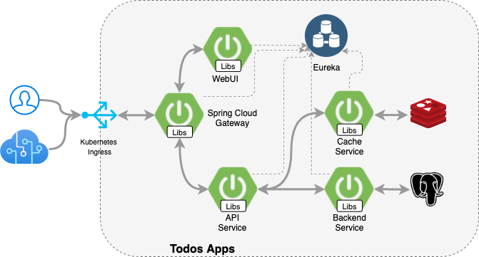
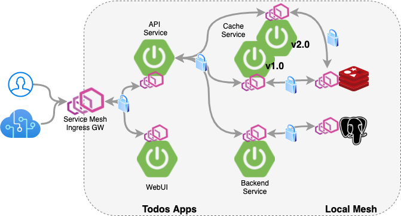
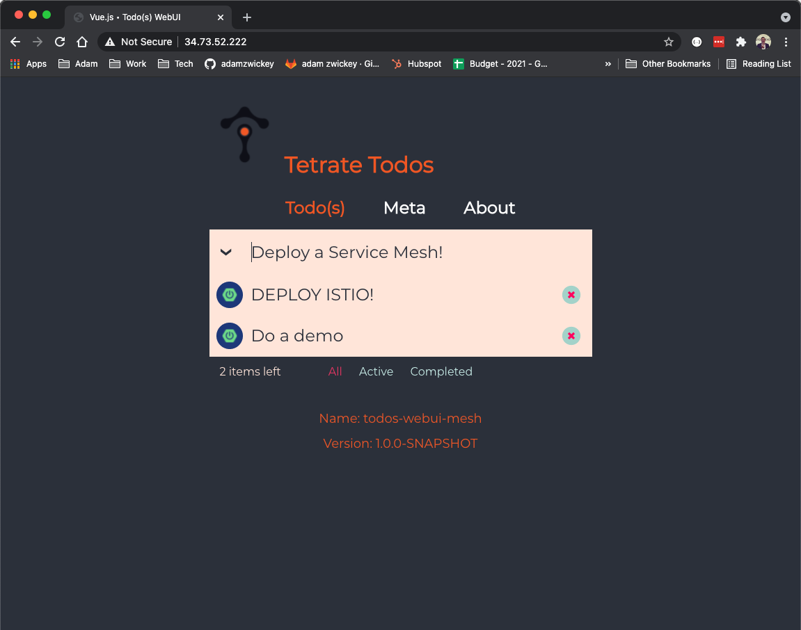

# tetrate-todos
Tetrate Todos is a sample app that demonstrates a migration from utlizing Spring Cloud modules for common cloud-native patterns, such as client-side load balancing, circuit breaking, service discovery, ect., to utilizng a Service Mesh.  

Before Istio Service Mesh:


After with Istio Service Mesh:


## Deploying
Prior to installing ensure you have a kubernetes cluster, kubectl  and helm CLIs installed.

- To build from source you need a image registry to push the application images.  Set a `REGISTRY` variable and then execute the `all-legacy` make target to build the original application.  This will build the application, create and push the appliation images to a registy, and deploy the application services to the `todos-legacy` namespace on the targeted cluster.
```bash
$ export REGISTRY=gcr.io/abz-env 
$ make all-legacy -e image-repo=$REGISTRY 
```

- You can obtain the external IP addresses for the application from the list of kubernetes services.  The Eureka service registry is exposed via the `todos-registry` service on port 8761 and the appliction webui is exposed via the `todos-service` service on port 8080
```bash
$ kubectl get svc -n todos-legacy

NAME             TYPE           CLUSTER-IP     EXTERNAL-IP   PORT(S)          AGE
postgres         ClusterIP      10.3.255.220   <none>        5432/TCP         9s
redis            ClusterIP      10.3.246.223   <none>        6379/TCP         9s
todos-api        ClusterIP      10.3.249.9     <none>        8080/TCP         9s
todos-postgres   ClusterIP      10.3.244.246   <none>        8080/TCP         8s
todos-redis      ClusterIP      10.3.243.23    <none>        8080/TCP         8s
todos-registry   LoadBalancer   10.3.250.113   35.243.167.50     8761:32405/TCP   8s
todos-service    LoadBalancer   10.3.244.71    35.243.167.55     8080:30498/TCP   9s
todos-webui      ClusterIP      10.3.242.63    <none>        8080/TCP         8s
```

- Prior to deploying the mesh-enabled version of the application you will need to deploy Istio to the cluster.  The simplest way to do this is using [Tetrate Istio Distribution](https://istio.tetratelabs.io/).  2 simple commands will enable this:
```bash
$ curl -sL https://dl.getistio.io/public/raw/files/download.sh | bash
$ getistio istioctl install --set profile=demo
```

- To build the service mesh enabled version of the application execute the `all-mesh` make target.  This will build the application, create and push the appliation images to a registy, and deploy the application services along with Istio Policy to the `todos` namespace on the targeted cluster.
```bash
$ make all-mesh -e image-repo=$REGISTRY 
```

- The application will be exposed on port 80 using the istio ingress gateway.  You can obtain the IP address of the gateway from kubernetes:
```bash
$ kubectl get svc -n istio-system -l app=istio-ingressgateway 
```

